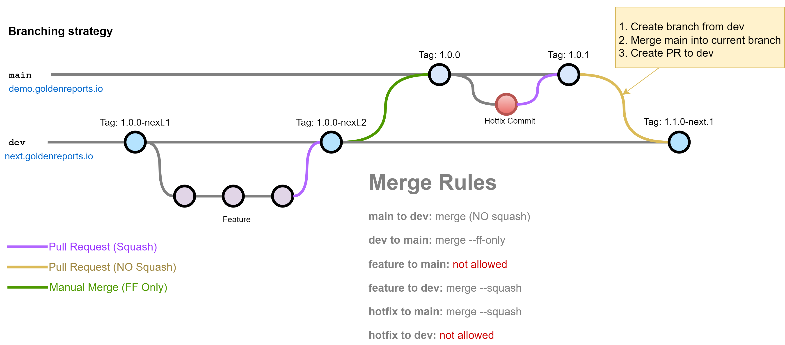

# Branching



## New Feature / Bug fix (not hotfix)
1. Clone git repo
  ```sh
  git clone https://github.com/goldenreports/golden-reports.git
  ```
2. Switch to dev branch
  ```sh
  git switch dev
  ```
3. Create the branch you will start working on
  ```sh
  git switch -c my-new-feature
  ```
4. Work on your feature
5. Merge dev brach periodically if it's a big feature to avoid a huge amount of conflicts when it's time to merge back to dev
6. Create a new GitHub PR to dev
7. Don't forget to include the number of issue that the PR closes in the description
  ```md
  closes #3
  ```
8. The PR should be Squash and Merge

## Hot fix

### Main branch
1. Clone git repo
  ```sh
  git clone https://github.com/goldenreports/golden-reports.git
  ```
2. Create the branch you will start working on
  ```sh
  git switch -c the-hot-fix
  ```
3. Work on your hotfix
4. Create a new GitHub PR to main
5. Don't forget to include the number of issue that the PR closes in the description
  ```md
  closes #3
  ```
6. The PR should be ```Squash and Merge```

### Dev branch (once merge into main is completed)
1. Checkout dev branch
```sh
git switch dev
```
2. Create new dev branch from dev
```sh
git switch -c the-hot-fix
```
3. Merge master into new branch
```sh
git merge master
```
4. Fix conflicts (if any) and commit those changes
5. Create Github PR
6. The PR should be ```Create a merge commit```


## Manual merge of dev into main (New release)
```sh
git switch dev
git pull
gut switch main
git pull
git merge --ff-only dev
git push
```


